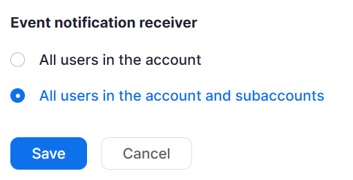

# zoom-popup
Zoom Phone Popup based on Webhook and Websockets

## Features
- Get Zoom Phone incomming call notification.
- Notify to a simple agent to open an URL with the parameters via Websockets

## Register Zoom App in Marketplace
1. Go to https://marketplace.zoom.us/user/build
2. Follow the instructions


3. Agregar permiso para recibir eventos de todas la cuentas del tenant

## Compile and install

1. Update the Ubuntu Distro
```Shell
$ sudo apt update
$ sudo apt upgrade
```

2. Install the dependencies
```Shell
$ npm install
```

3. Configure the .env
```Shell
PORT = 3000
ZOOM_WEBHOOK_SECRET_TOKEN = 
```
